# 📱 Projeto Vayziru: Estudo de Viabilidade de Microserviços em Hardware ARM Mobile

Este repositório contém a implementação técnica e a base metodológica para uma pesquisa científica acerca da viabilidade da utilização de dispositivos móveis (Android) como servidores web públicos. O projeto atua como laboratório prático para o Trabalho de Conclusão de Curso (TCC) detalhado abaixo.

---

## Análise da Viabilidade de Utilização de Dispositivos Móveis como Servidor Virtual Privado (VPS) para Micro e Pequenas Empresas

Estudo de Caso com Foco no Cenário Brasileiro.

* **Autor:** Marcos Henrique da Silva Figueiredo
* **Curso:** Análise e Desenvolvimento de Sistemas
* **Instituição:** Universidade Católica de Brasília (UCB)

### 📋 Resumo

Este repositório documenta um estudo de caso descritivo sobre a viabilidade técnica e econômica da utilização de um dispositivo móvel comercial (smartphone) como Servidor Virtual Privado (VPS) para a hospedagem de aplicações web. A investigação foi motivada pelos elevados custos de infraestrutura em nuvem (Cloud Computing) no cenário econômico brasileiro, o que impõe barreiras a microempresas e startups.

A metodologia baseou-se na implantação de três microsserviços (Spring Boot e Quarkus) num ambiente emulado via Termux, sem privilégios de administrador (root), expostos à internet via Cloudflare Tunnel. Conduziram-se testes empíricos de estresse (escalando até 50.000 requisições simultâneas) e um monitoramento observacional de 30 dias em cenário de produção simulado.

Os dados recolhidos indicam que o sistema Android e a JVM são capazes de sustentar elevados volumes de tráfego temporário; contudo, a operação ininterrupta expõe o hardware a estresse térmico cumulativo e exigências severas de manutenção manual. Analiticamente, conclui-se que o modelo oferece uma redução drástica de custos operacionais (OPEX), viabilizando Provas de Conceito (PoC), mas herda vulnerabilidades arquiteturais de rede e riscos estruturais severos de perda de dados.

**Palavras-chave:** VPS, Dispositivos Móveis, Termux, Microsserviços, Spring Boot, Edge Computing.

---

### 🎯 1. Introdução

O cenário macroeconômico brasileiro impõe desafios financeiros significativos às micro e pequenas empresas. Embora a automatização do desenvolvimento de software tenha reduzido os custos de engenharia, a manutenção da infraestrutura tecnológica (servidores em nuvem como AWS, Azure ou Google Cloud) mantém-se como um fator de peso no orçamento.

Neste contexto, surge a hipótese do reaproveitamento de hardware preexistente — especificamente dispositivos móveis (smartphones) de médio ou alto desempenho — para atuar como VPS. O presente estudo de caso tem como objetivo analisar de forma descritiva e factual o comportamento, a performance, a estabilidade, os limites e os custos da orquestração de um ambiente de microsserviços Java num dispositivo Android (Motorola Edge 30 Neo), focado em três eixos:

- **Limites de Disponibilidade:** Avaliação da latência e resistência do sistema perante picos de tráfego (stress tests).
- **Estabilidade a Longo Prazo:** Observação das necessidades de manutenção ao longo de 30 dias de monitoramento observacional.
- **Análise de Viabilidade (OPEX):** Comparativo do esforço de configuração e custos diretos entre mobile, VPS padrão e Cloud computing.

### 🛠️ 2. Arquitetura e Tecnologias Utilizadas

A infraestrutura do projeto foi implantada baseando-se nas seguintes tecnologias e restrições metodológicas:

- **Backend:** Java 17+ / Java 21 / Spring Boot 3.x / Quarkus.
- **Infraestrutura/Emulação:** Android formatado para isolamento de variáveis sem privilégios *root*, utilizando o Termux/Proot e PM2 para gerenciamento de processos.
- **Rede de Borda:** Cloudflare Tunnel (exposição de portas TCP locais à internet de forma segura, contornando CGNAT e ausência de IP fixo).
- **Banco de Dados:** Instâncias otimizadas (SQLite / H2 em memória) para redução do gargalo de I/O de disco da memória flash mobile.

**Microsserviços Desenvolvidos no Experimento:**
- **Gateway (Spring Boot):** API Gateway responsável por rotear conexões externas e hospedar a interface estática (`index.html`).
- **Busca INPI (Spring Boot):** Serviço focado em consumir grandes arquivos em memória (carga, desserialização e parse de XML contendo mais de 550.000 registros do INPI).
- **SQL/Persistência (Quarkus):** Microsserviço de gravação de métricas com banco de dados em memória `H2`.

### 📊 3. Experimentos e Resultados

Foram conduzidos testes empíricos assíncronos controlados via scripts em Python (para injetar carga e desativar PM2, isolando o impacto sobre a JVM) e testes observacionais.

#### 3.1 Teste 1: Estresse de Disponibilidade e Latência (Página Estática)
Ensaio focado no limite de disponibilidade, escalando de 10 a 50.000 conexões simultâneas (threads leves):

- **Nível 1** (100.000 req. | Conc. 10): Latência média de 0,0154s.
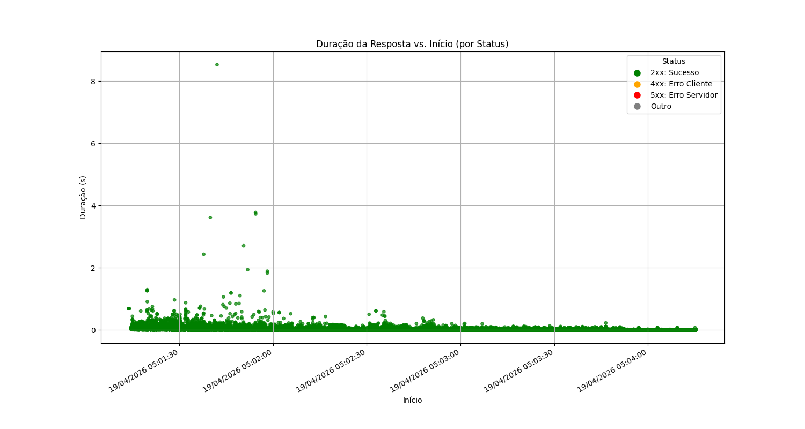

- **Nível 2** (100.000 req. | Conc. 25): Latência média de 0,0224s.
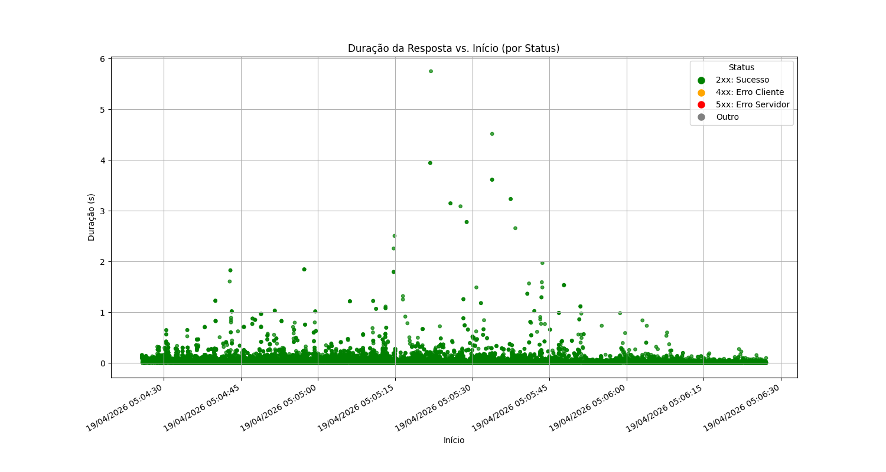

- **Nível 3** (1.000.000 req. | Conc. 50): Latência média de 0,0599s.
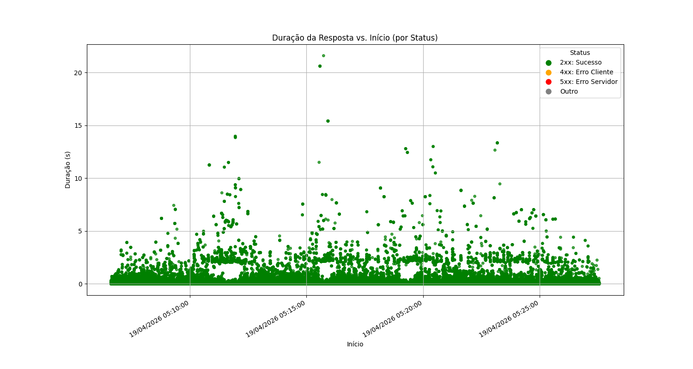

- **Nível 4** (1.000.000 req. | Conc. 100): Latência média de 0,1333s.
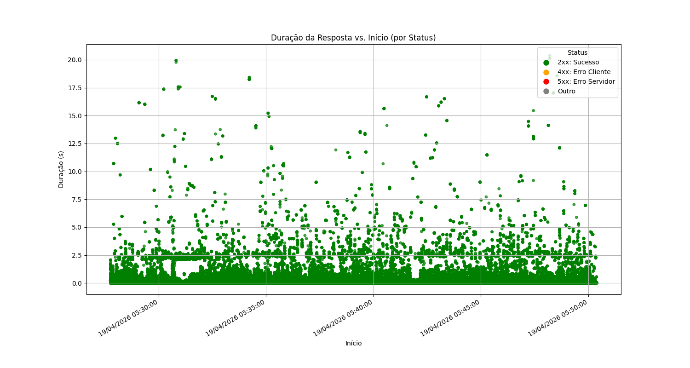

- **Nível 5** (1.000.000 req. | Conc. 200): Latência média de 0,2636s.
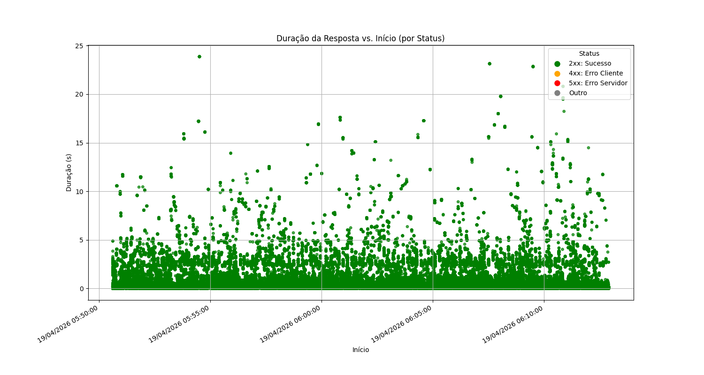

- **Nível 6** (1.000.000 req. | Conc. 500): Latência média de 0,6669s.
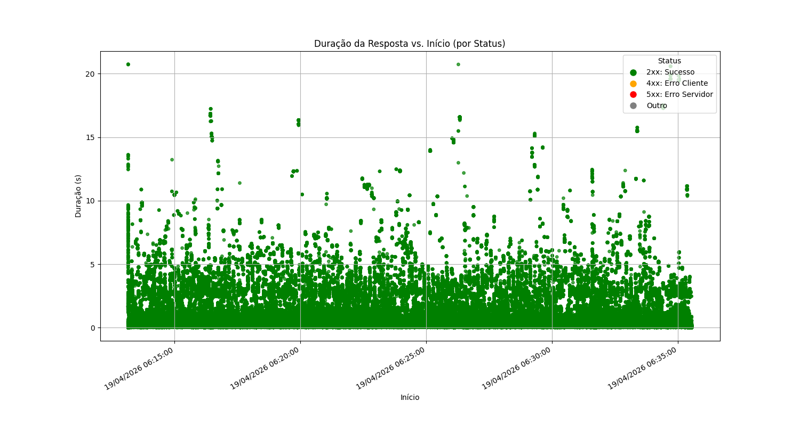

- **Nível 7** (1.000.000 req. | Conc. 1.000): Latência média de 1,3245s. *(Limite operacional prático)*
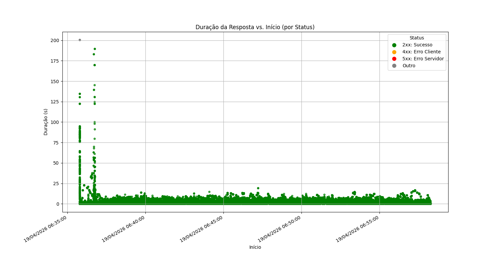

- **Nível 8** (1.000.000 req. | Conc. 10.000): Latência média de 61,4704s. *(Falhas de 28,5%)*
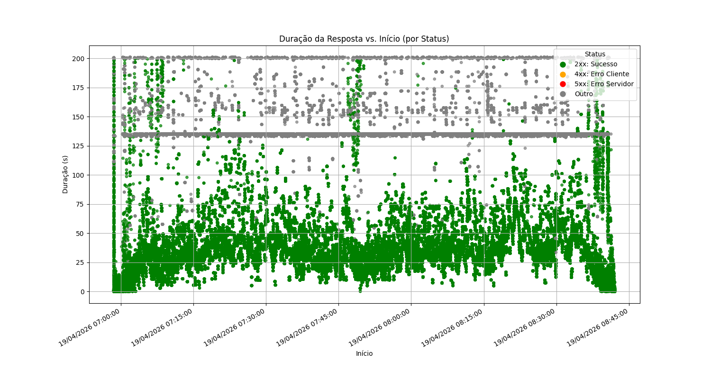

- **Nível 9** (1.000.000 req. | Conc. 25.000): Latência média de 97,7808s. *(Falhas de 55,8%)*
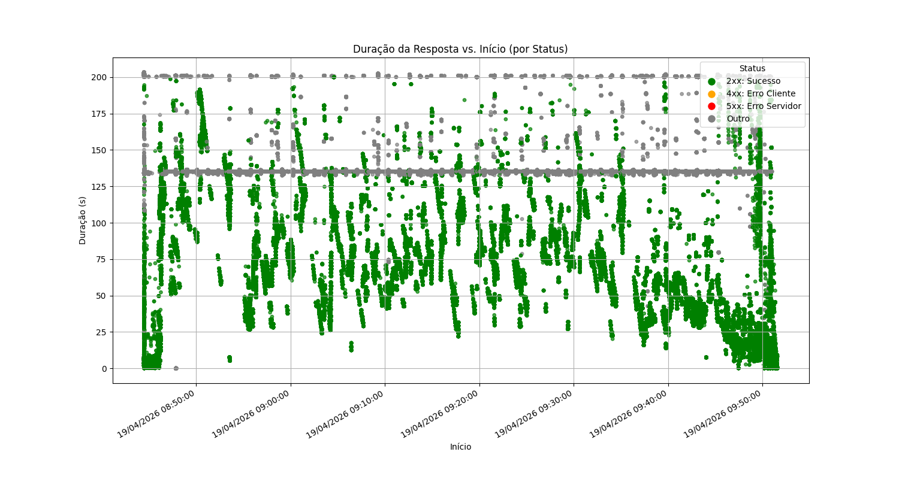

- **Nível 10** (1.000.000 req. | Conc. 50.000): Latência média de 16,3841s. *(Colapso: 98,5% das req. com erro)*
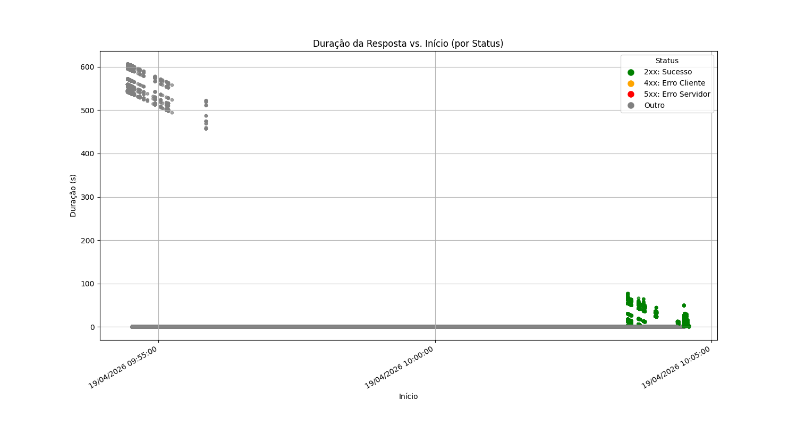

> *Nota Metodológica:* Cada nível foi executado sequencialmente com intervalo de arrefecimento de 10s. O hardware e o Android mantiveram a estabilidade térmica/processamento sem encerramentos forçados (Kernel Panic).

#### 3.2 Teste 2: Carga do Serviço Spring Boot (Busca no INPI)
Teste exigindo maior alocação de recursos (desserialização de *strings* XML e instanciação pesada de objetos na Heap da JVM):

- **Nível 1** (10.000 req. | Conc. 10): Latência média de 2,4373s.
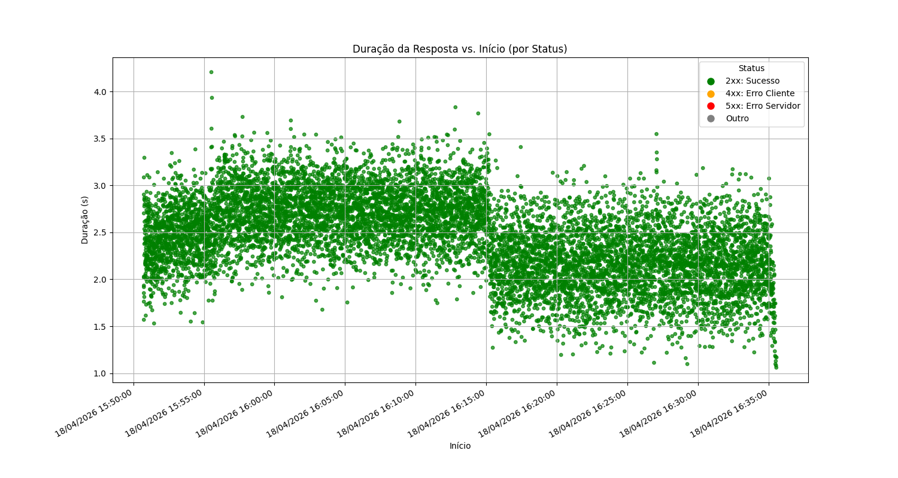

- **Nível 2** (10.000 req. | Conc. 25): Latência média de 6,8445s.
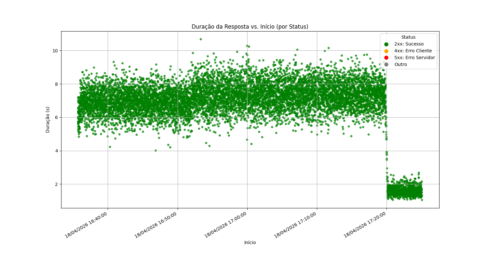

- **Nível 3** (10.000 req. | Conc. 50): Latência média de 13,4713s. *(Excede aceitabilidade web moderna)*
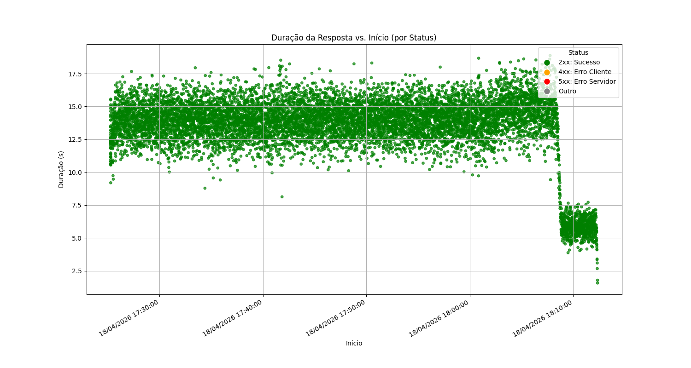

- **Nível 4** (10.000 req. | Conc. 100): Latência média de 29,5555s.
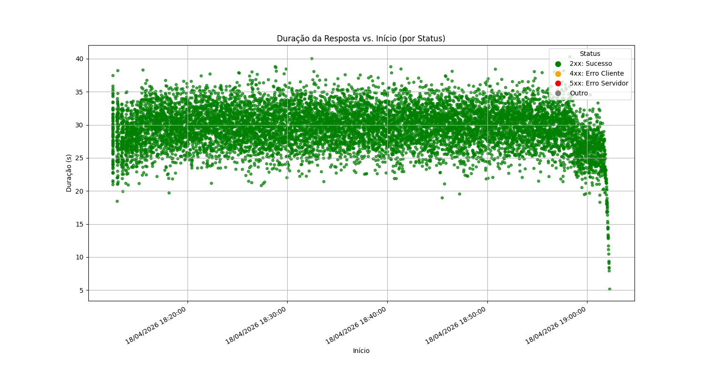

- **Nível 5** (100.000 req. | Conc. 200): Latência média de 56,7554s.
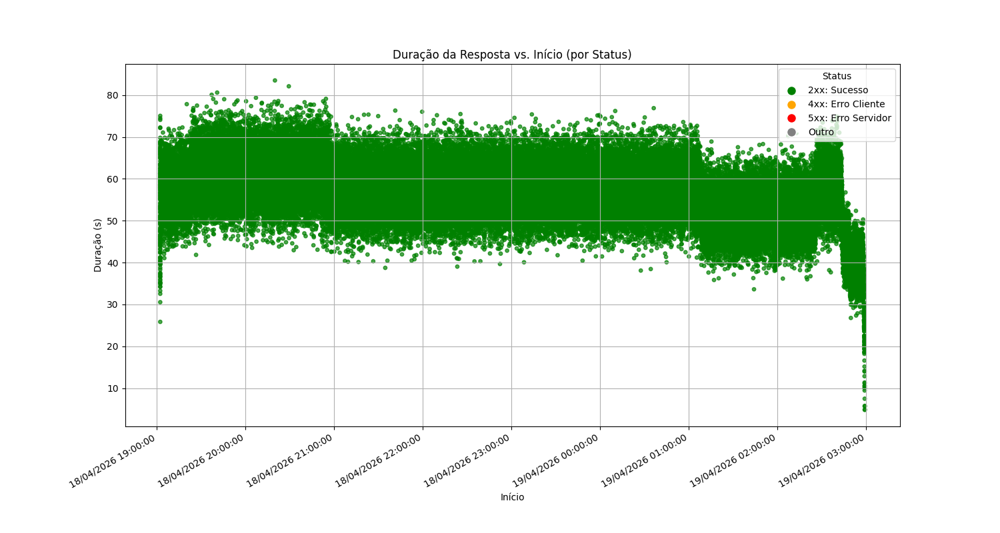

- **Nível 6** (100.000 req. | Conc. 500): Latência média de 17,0140s. *(Degradação: 87,7% de erros)*
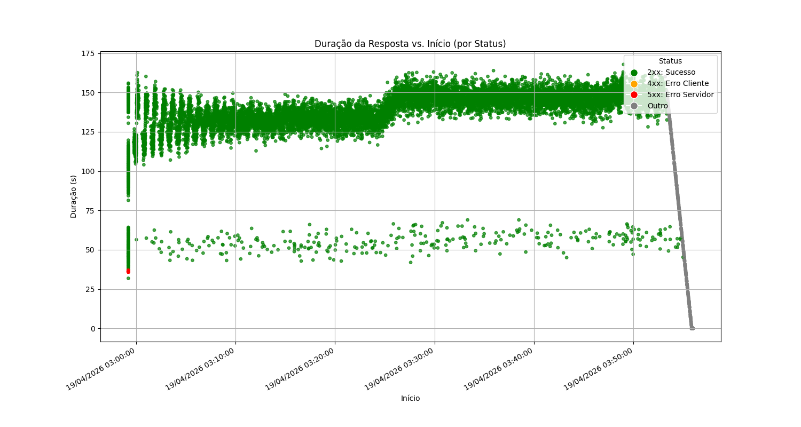

- **Níveis 7 a 10** (Conc. 1.000 a 50.000): O colapso do serviço gera rejeições quase instantâneas. O gerenciador de memória do Android encerra violentamente o processo (OOM Killer), resultando em taxa de erro de 100%.
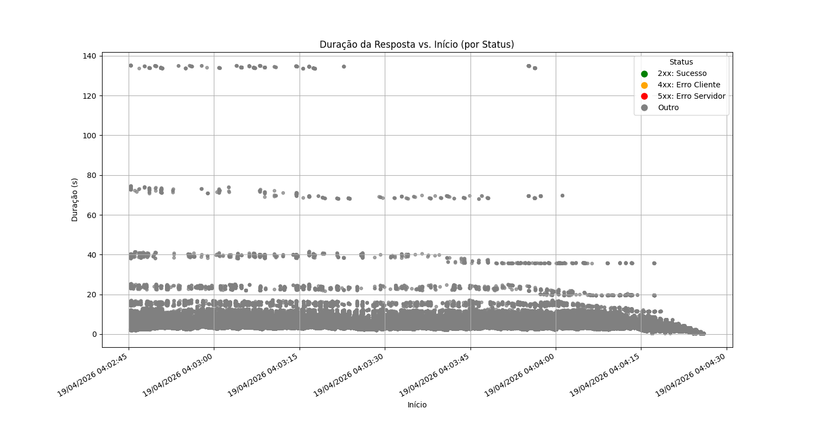

> *Nota:* Os arquivos XML contendo dados brutos do INPI foram suprimidos do repositório por questões de conformidade legal/tamanho.

#### 3.3 Teste 3: Monitoramento Contínuo em Produção Simulado (30 Dias)
O dispositivo foi exposto à internet de forma ininterrupta por 30 dias (PM2 ativado). A latência média de processamento interno registrada no período foi de 0,09s.
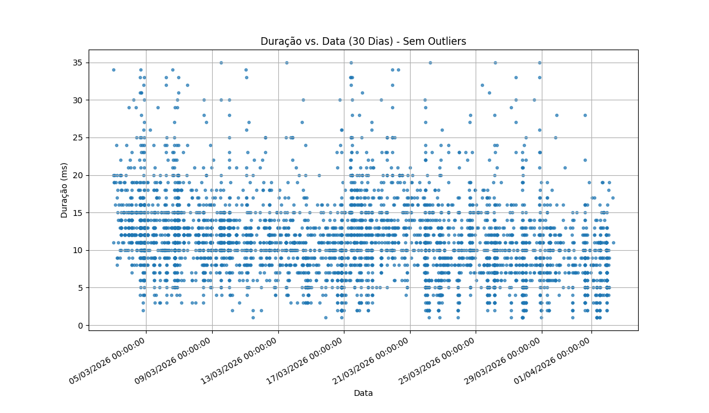

Eventos Operacionais Observados:
- **Gestão de Energia (Dia 6):** O protocolo manual de ciclagem de bateria falhou, resultando em desligamento abrupto. Exigiu religamento e intervenção manual no Termux (Java, Cloudflare, PM2).
- **Deploy Manual (Dia 17):** Atualização do código exigiu reativação do SSH, transferência manual de binários `.jar` via SCP e reinicialização de processos, devido à ausência de automação de CI/CD nativa.
- **Limitações Exógenas:** A dependência de rede Wi-Fi doméstica insere Pontos Únicos de Falha (SPOF), afetando negativamente a disponibilidade.

### 💰 4. Comparativo de Custos Operacionais (OPEX)

Abaixo, a síntese de custos considerando o dispositivo móvel utilizado *(Motorola Edge 30 Neo, 8-cores e ~4 GB RAM livre para processos em foreground)*, comparado a soluções tradicionais (considerando USD 1,00 = BRL 5,00 e infraestrutura de rede preexistente):

| Plataforma / Modelo | RAM Disponível | vCPUs | Estimativa Mensal (BRL) |
| :--- | :--- | :--- | :--- |
| **AWS Cloud** *(t4g.medium)* | 4 GB | 2 | ~ R$ 120,00 |
| **VPS Padrão** *(Hostinger KVM2)* | 4 GB | 2 | ~ R$ 43,00 |
| **Mobile** *(Edge 30 Neo)* | ~ 4 GB | 8 | ~ R$ 2,00 *(Energia)* |

### 📌 5. Conclusões e Síntese Descritiva

A avaliação analítica consolida três vetores referentes à utilização de smartphones como VPS num ambiente emulado:
1. **Baixo Custo Financeiro:** Apresenta uma redução drástica no OPEX, representando um trade-off favorável exclusivamente para execução de Provas de Conceito (PoCs) ou MVPs em estágios iniciais (bootstrapping).
2. **Baixa Confiabilidade e Estabilidade:** A infraestrutura é suscetível a gargalos de rede Wi-Fi, requer gestão manual diária do ciclo de recarga das baterias e carece de suporte nativo a conteinerização flexível (como o Docker puro).
3. **Alto Risco Estrutural:** A alocação ininterrupta em hardware desenvolvido para uso flutuante eleva a probabilidade de estresse térmico acelerado e falha de componentes. A ausência de redundância em disco resulta em um risco irreparável de perda total de dados, tornando o modelo inadequado para ambientes de produção críticos ou persistência de dados sensíveis.

### 📝 Status do Projeto
- [x] Configuração do Ambiente e Isolamento (Android/Termux)
- [x] Implementação do API Gateway e Microsserviços
- [x] Coleta de Dados Laboratoriais e Stress Tests (Concluído)
- [ ] Formatação e publicação final dos dados (Em andamento)
- [ ] Publicar como artigo científico

### 📚 Referências
- **Amazon Web Services (AWS)**: Tabela de precificação de instâncias EC2 sob demanda. Disponível em: https://aws.amazon.com/pt/ec2/pricing/on-demand/
- **STUDIOCONNECTA**: Parâmetros de tolerância de latência em ambientes web. Disponível em: https://studioconnecta.com/artigos/3-segundos-o-suficiente-para-o-usuario-abandonar-seu-site/
